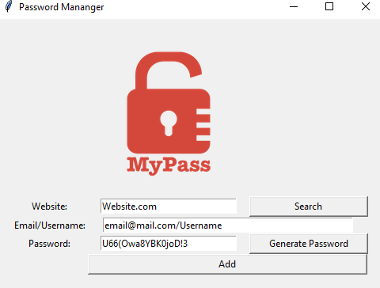

Here is a detailed `README.md` for your project:

# Password Manager

## Description

This is a simple password manager application built using Python and Tkinter. It allows users to generate strong passwords, save them securely, and retrieve them when needed.

## Features

- Generate strong, random passwords.
- Save passwords along with the associated website and username.
- Prevent duplicate entries for the same website.
- Search for saved passwords.

## Requirements

- Python 3.x
- Tkinter (usually included with Python)
- Pyperclip (for copying passwords to clipboard)

## Installation

1. Clone the repository:
    ```sh
    git clone https://github.com/yourusername/password-manager.git
    cd password-manager
    ```

2. Install the required packages:
    ```sh
    pip install pyperclip
    ```

## Usage

1. Run the application:
    ```sh
    python password_manager.py
    ```

2. The main window will appear with the following options:
    - **Website**: Enter the website for which you want to save the password.
    - **Email/Username**: Enter your email or username for the website.
    - **Password**: Enter a password or click "Generate Password" to create a strong password.
    - **Add**: Save the entered details.
    - **Search**: Retrieve saved details for a specific website.

## File Structure

- `password_manager.py`: The main application file.
- `password_info.json`: The file where passwords are stored.
- `README.md`: This file.
- `logo.png`: The logo image used in the application.

## Code Overview

### Password Generation

The password is generated using a combination of letters, numbers, and symbols. The length and composition are randomized to ensure strong passwords.

### Saving Passwords

Passwords are saved in a JSON file (`password_info.json`). The application checks for duplicate entries and prompts the user before saving.

### Searching Passwords

Users can search for saved passwords by entering the website name. The application retrieves and displays the associated username and password.

## Screenshot

Here's a preview of the Weather App:



## Contributing

Feel free to submit issues or pull requests. Contributions are welcome!

## Acknowledgements

- [Tkinter](https://docs.python.org/3/library/tkinter.html) for the GUI.
- [Pyperclip](https://pypi.org/project/pyperclip/) for clipboard functionality.

## Contact

For any questions or suggestions, please open an issue or contact the repository owner.

## License

This project is licensed under the MIT License. See the [LICENSE.txt](docs/LICENSE.txt) file for details.

---